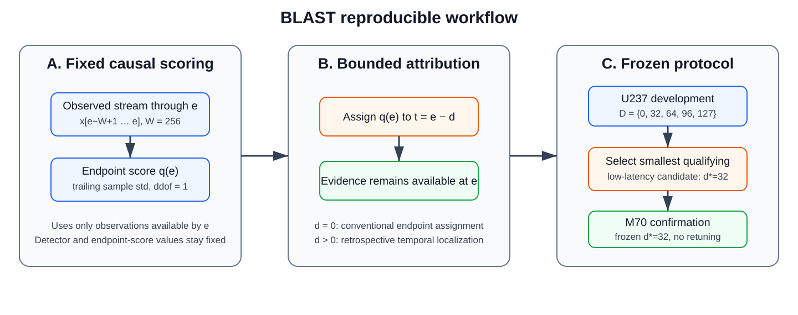
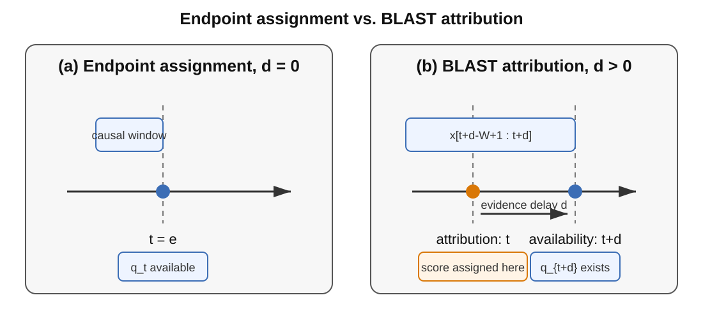
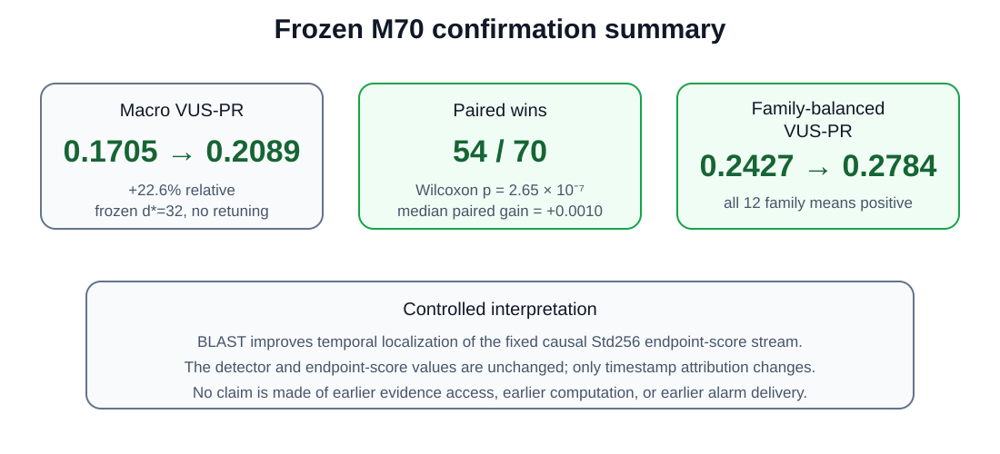

<div align="center">

# BLAST: Bounded-Latency Attribution of Streaming Time-Series Anomalies

**Reference implementation and reproducibility companion for the ICASSP 2027 submission**

Hammad Ali Haider¹ · Marcin Pietroń² · Roberto Corizzo³ · Panpan Zheng¹  
¹ Xinjiang University · ² AGH University of Krakow · ³ American University

[](https://github.com/hammadhaideer/BLAST-TSAD/actions/workflows/ci.yml)
[](https://www.python.org/)
[](#release-status)
[](LICENSE)
[](#citation)

[**Overview**](#overview) · [**Method**](#method) · [**Results**](#main-results) · [**Reproduce**](#reproduce-the-paper) · [**Data**](#data) · [**Protocol**](docs/PROTOCOL.md) · [**Result ledger**](docs/RESULTS.md) · [**Citation**](#citation)

</div>

---

## Overview

**BLAST** is a bounded-latency attribution framework for causal streaming time-series anomaly scores. It separates two timestamps that are often conflated in sliding-window detection:

1. **attribution time** — where a score is assigned on the event timeline;
2. **evidence-availability time** — when the observations supporting that score actually exist.

For a causal endpoint score `q_e` and non-negative delay `d`, BLAST defines

$$
s_d(t)=q_{t+d}, \qquad r_d(t)=t+d.
$$

> **BLAST changes timestamp attribution only.** It does not retrain the detector, alter endpoint-score values, use observations before they arrive, or claim earlier alarm delivery.

<p align="center">
  
</p>
<p align="center"><sub>Fixed causal scoring → bounded attribution → frozen U237-to-M70 confirmation protocol.</sub></p>

## Method

The submitted study uses a fixed causal trailing sample-standard-deviation score with `W=256`. For M70, each channel is normalized using statistics fitted only on its filename-defined training prefix, the trailing statistic is computed per channel, and channel scores are averaged.

<p align="center">
  
</p>
<p align="center"><sub>Conventional endpoint assignment and BLAST attribution use the same causal endpoint-score stream; only the timestamp assignment changes.</sub></p>

The operating-point protocol is frozen:

1. **U237 development:** evaluate `D={0,32,64,96,127}` on the fixed Std256 stream;
2. **low-latency candidates:** `{32,64}`;
3. **selection:** choose the smallest candidate satisfying every predeclared gate;
4. **freeze:** select `d*=32`;
5. **M70 confirmation:** generate scores label-free, then evaluate the frozen setting without retuning or any second-stage selection rule.

M70 is confirmatory only: no M70 threshold, pass/fail gate, or alternative-delay search is used to select or modify the operating point.

The exact score construction, numerical scale floor, five U237 selection gates, VUS call, label-access rules, and right-boundary convention are specified in [`docs/PROTOCOL.md`](docs/PROTOCOL.md).

## Main results

The primary comparison holds the underlying causal endpoint-score stream fixed and changes only temporal attribution. Values below are macro **VUS-PR** unless otherwise stated.

| Cohort | Base (`d=0`) | BLAST (`d=32`) | Gain | Wins | Wilcoxon `p` |
|---|---:|---:|---:|---:|---:|
| U237 development | 0.3043 | **0.3300** | +0.0257 | 183 / 237 | 3.85e-22 |
| M70 confirmation | 0.1705 | **0.2089** | +0.0384 | 54 / 70 | 2.65e-7 |

On M70, the frozen configuration yields a **22.6% relative macro VUS-PR increase without retuning**. Family-balanced VUS-PR changes from **0.2427 to 0.2784**, and all 12 family mean gains are positive.

<p align="center">
  
</p>
<p align="center"><sub>Frozen M70 confirmation at d*=32; no score retuning or delay reselection is performed on M70.</sub></p>

### Development latency sweep

| Delay `d` | `d/W` | U237 VUS-PR | Gain vs. `d=0` | Role |
|---:|---:|---:|---:|---|
| 0 | 0.000 | 0.3043 | 0.0000 | reference |
| **32** | 0.125 | **0.3300** | +0.0257 | **selected** |
| 64 | 0.250 | 0.3503 | +0.0461 | qualifies, not selected |
| 96 | 0.375 | 0.3676 | +0.0633 | development sweep only |
| 127 | 0.496 | 0.3696 | +0.0653 | development sweep only |

The selected delay is therefore the **smallest qualifying low-latency operating point**, not the development optimum.

### Post-freeze robustness

| Cohort | Metric | Base (`d=0`) | BLAST (`d=32`) | Gain | `p` |
|---|---|---:|---:|---:|---:|
| U237 | AP | 0.2586 | 0.2864 | +0.0278 | 6.09e-11 |
| U237 | AUROC | 0.6691 | 0.6903 | +0.0212 | 1.21e-3 |
| U237 | VUS-ROC | 0.7216 | 0.7357 | +0.0141 | 8.30e-6 |
| M70 | AP | 0.1398 | 0.1830 | +0.0432 | 4.71e-4 |
| M70 | AUROC | 0.5259 | 0.5428 | +0.0169 | **0.0657** |
| M70 | VUS-ROC | 0.6087 | 0.6209 | +0.0122 | 1.95e-4 |

The M70 AUROC increase is reported explicitly as **not statistically significant** at the conventional 0.05 level. Full-precision values and the common-support boundary check are in [`docs/RESULTS.md`](docs/RESULTS.md).

## Installation

```bash
git clone https://github.com/hammadhaideer/BLAST-TSAD.git
cd BLAST-TSAD
conda env create -f environment.yml
conda activate blast-tsad
python -m pip install -e .
```

Pip-only installation is also supported:

```bash
python -m pip install -e .
```

Reference stack:

```text
Python          3.11
NumPy           2.4.4
SciPy           1.17.1
pandas          3.0.3
scikit-learn    1.9.0
vus             0.0.6
```

## Quick verification

```bash
python -m pip install pytest
python scripts/verify_repository.py
pytest
python examples/minimal_example.py
```

A successful artifact check ends with:

```text
BLAST_PUBLIC_REPOSITORY_VERIFICATION: PASS
```

## Data

The experiments use the public [TSB-AD](https://github.com/TheDatumOrg/TSB-AD) benchmark. The official benchmark documentation provides these archives:

- [TSB-AD-U.zip](https://www.thedatum.org/datasets/TSB-AD-U.zip)
- [TSB-AD-M.zip](https://www.thedatum.org/datasets/TSB-AD-M.zip)

Raw benchmark archives are **not** redistributed here. Place the independently obtained files at:

```text
data/
└── tsb_ad/
    ├── TSB-AD-U.zip
    └── TSB-AD-M.zip
```

Every experimental runner checks the frozen archive/cohort SHA256 values before computation. An upstream archive that does not match the frozen hash is rejected rather than silently treated as an exact reproduction. See [`docs/DATA.md`](docs/DATA.md).

## Reproduce the paper

After the verified archives are in place:

```bash
python scripts/reproduce_paper.py
```

The command runs, in order:

```text
repository/provenance verification
        ↓
U237 development selection
        ↓
M70 label-free score generation
        ↓
M70 frozen confirmatory evaluation
        ↓
post-freeze metric + common-support checks
        ↓
exact manuscript-number audit
```

A successful full rerun ends with:

```text
BLAST_MANUSCRIPT_NUMBERS: PASS
BLAST_PAPER_REPRODUCTION: PASS
```

Manual stages and generated-output paths are documented in [`docs/REPRODUCIBILITY.md`](docs/REPRODUCIBILITY.md).

## Reproducibility safeguards

The public implementation deliberately fails rather than silently changing the submitted protocol:

- archive and cohort SHA256 mismatches abort execution;
- M70 scoring keeps the label field opaque until confirmatory evaluation;
- M70 pointwise score artifacts are hashed before labels are opened;
- M70 evaluation is frozen and descriptive only; no confirmation-driven delay search or pass/fail gate is used;
- VUS evaluation uses the pinned public `vus==0.0.6` implementation and explicit study arguments;
- non-finite scores abort rather than triggering a fallback metric;
- paper numbers are checked against the frozen numerical ledger;
- right-edge padding is accompanied by an identical-support sensitivity check.

## Repository structure

```text
BLAST-TSAD/
├── assets/paper/                  # documentation figures + integrity hashes
├── blast/
│   ├── core.py                    # attribution, Std256, exact M70 normalization
│   ├── data.py                    # TSB-AD readers and label-free access
│   ├── metrics.py                 # VUS/AP/AUROC and paired statistics
│   └── provenance.py              # frozen archive/cohort checksums
├── configs/                       # exact U237 and M70 cohort manifests
├── docs/
│   ├── BASELINES.md
│   ├── DATA.md
│   ├── PROTOCOL.md
│   ├── REPRODUCIBILITY.md
│   ├── RELEASE_STATUS.md
│   └── RESULTS.md
├── examples/minimal_example.py
├── scripts/
│   ├── select_u237_delay.py
│   ├── score_m70_label_free.py
│   ├── evaluate_m70_confirmatory.py
│   ├── evaluate_postfreeze_robustness.py
│   ├── check_paper_results.py
│   ├── reproduce_paper.py
│   └── verify_repository.py
├── tests/
├── .github/workflows/ci.yml
├── CITATION.cff
├── LICENSE
├── environment.yml
├── pyproject.toml
└── requirements.txt
```

## Scientific scope

BLAST establishes a controlled improvement in **temporal localization** for the tested causal Std256 score stream under an explicit evidence delay. It does **not** claim earlier computation, earlier access to future observations, earlier alarm delivery, or a universally optimal delay across detectors/datasets.

Contextual detectors with different training or information-access protocols are not presented as interchangeable causal baselines. See [`docs/BASELINES.md`](docs/BASELINES.md).

## Release status

The current public implementation is **v1.0.2**. This patch clarifies that M70 is strictly confirmatory, adds direct official dataset links, and polishes public metadata without changing the frozen scientific protocol or reported numerical results. See [`CHANGELOG.md`](CHANGELOG.md) and [`docs/RELEASE_STATUS.md`](docs/RELEASE_STATUS.md).

## Citation

This repository accompanies the **ICASSP 2027 submission**. Until proceedings metadata are available, use [`CITATION.cff`](CITATION.cff):

```text
Hammad Ali Haider, Marcin Pietroń, Roberto Corizzo, and Panpan Zheng,
"BLAST: Bounded-Latency Attribution of Streaming Time-Series Anomalies,"
submitted to ICASSP 2027, 2026.
```

## License

Code and documentation authored for this repository are released under the [MIT License](LICENSE). TSB-AD, its underlying datasets, `vus`, and other third-party software retain their original licenses.
