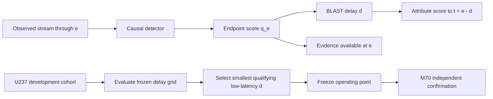

<div align="center">

# BLAST: Bounded-Latency Attribution of Streaming Time-Series Anomalies

**Official implementation for the paper submitted to ICASSP 2027**

Hammad Ali Haider¹ · Marcin Pietroń² · Roberto Corizzo³ · Panpan Zheng¹

¹ Xinjiang University · ² AGH University of Krakow · ³ American University

[](https://github.com/hammadhaideer/BLAST-TSAD/actions/workflows/ci.yml)
[](https://www.python.org/)
[](LICENSE)
[](#citation)

[**Method**](#method-overview) · [**Installation**](#installation) · [**Data**](#data-preparation) · [**Run BLAST**](#running-blast) · [**Reproducibility**](docs/REPRODUCIBILITY.md) · [**Citation**](#citation)

</div>

## Introduction

**BLAST** studies how a fixed causal anomaly-score stream should be assigned in time when useful evidence arrives after the event timestamp it best describes. The method explicitly separates **attribution time** from **evidence-availability time**.

For a causal endpoint score \(q_e\) and a non-negative delay \(d\), BLAST defines

\[
s_d(t)=q_{t+d}, \qquad r_d(t)=t+d,
\]

where \(s_d(t)\) is attributed to event timestamp \(t\), while \(r_d(t)\) records when the observations supporting that score are actually available.

> **BLAST changes timestamp attribution only.** It does not retrain the detector, alter the underlying endpoint score stream, use observations before they arrive, or claim an earlier alarm.

### Highlights

- **Causal information access** — scores use only observations available at their declared release time.
- **Bounded-latency attribution** — attribution time and evidence-availability time are represented separately.
- **Detector-preserving** — the score values and detector parameters remain unchanged.
- **Frozen development → confirmation protocol** — delay selection is performed on U237 and transferred unchanged to M70.
- **Label-free confirmation scoring** — M70 score generation does not parse anomaly labels.
- **Official VUS-PR evaluation** — the repository uses the pinned `vus` implementation and the study's per-entity temporal buffer definition.

## Method Overview



The primary score stream in the submitted study is a causal trailing sample-standard-deviation statistic with window length \(W=256\). On multivariate M70 series, each channel is normalized using statistics fitted only on its training prefix; per-channel trailing standard deviations are then averaged into one scalar endpoint score.

The full experimental protocol, selection gates, label-access rules, metric definition, and right-boundary convention are documented in [`docs/PROTOCOL.md`](docs/PROTOCOL.md).

## Installation

Clone the repository and create the reference environment:

```bash
git clone https://github.com/hammadhaideer/BLAST-TSAD.git
cd BLAST-TSAD
conda env create -f environment.yml
conda activate blast-tsad
python -m pip install -e .
```

A pip-only installation is also supported:

```bash
git clone https://github.com/hammadhaideer/BLAST-TSAD.git
cd BLAST-TSAD
python -m pip install -e .
```

Reference software stack:

```text
Python          3.11
NumPy           2.4.4
SciPy           1.17.1
pandas          3.0.3
scikit-learn    1.9.0
vus             0.0.6
```

## Quick Verification

The repository includes unit tests, a synthetic BLAST example, and an invariant checker:

```bash
python -m pip install pytest
python scripts/verify_repository.py
pytest
python examples/minimal_example.py
```

The same checks run automatically in GitHub Actions.

## Data Preparation

The experiments use the public **TSB-AD** univariate and multivariate benchmark archives. Dataset files are not redistributed by this repository.

Place independently obtained archives at:

```text
data/
└── tsb_ad/
    ├── TSB-AD-U.zip
    └── TSB-AD-M.zip
```

Frozen archive checksums, cohort checksums, training-boundary conventions, and label-handling details are provided in [`docs/DATA.md`](docs/DATA.md).

## Running BLAST

The public runners follow the submitted protocol in three stages.

### 1. U237 development selection

```bash
python scripts/select_u237_delay.py
```

This computes the fixed causal score stream, evaluates the frozen delay grid, applies the development-only selection rule, and writes generated outputs under `results/`.

### 2. M70 label-free score generation

```bash
python scripts/score_m70_label_free.py
```

This stage reads feature columns while keeping the final label field opaque, fits normalization on the training prefix only, and generates endpoint/attributed score arrays without computing an anomaly metric.

### 3. M70 confirmatory evaluation

```bash
python scripts/evaluate_m70_confirmatory.py
```

Only after the label-free score package exists does this stage read M70 labels and evaluate the already frozen delay. It does not search for another operating point or retune the score function.

For custom paths, each runner exposes `--data`, `--cohort`, and output arguments through `--help`.

## Evaluation

The primary metric is **VUS-PR** using the pinned `vus==0.0.6` package. The per-entity evaluation buffer is

\[
L_e = \max\left(1,\operatorname{round}(\operatorname{median}\{\text{ground-truth anomaly-run lengths}\})\right).
\]

The public metric wrapper fails explicitly if the official VUS implementation is unavailable; it does not silently replace VUS-PR with a different metric.

The broader M70 benchmark contains methods with different information-access assumptions. Their protocol categories and the pinned TSB-AD reference used by the submission are documented in [`docs/BASELINES.md`](docs/BASELINES.md); they should not be interpreted as strictly interchangeable causal competitors.

## Repository Structure

<details>
<summary>Click to expand</summary>

```text
BLAST-TSAD/
├── blast/
│   ├── core.py                 # BLAST attribution and causal Std256 scoring
│   ├── data.py                 # TSB-AD readers and label-free access
│   └── metrics.py              # VUS-PR and paired statistics
├── configs/                    # frozen U237 and M70 cohort manifests
├── docs/
│   ├── BASELINES.md
│   ├── DATA.md
│   ├── PROTOCOL.md
│   ├── REPRODUCIBILITY.md
│   └── RELEASE_STATUS.md
├── examples/
│   └── minimal_example.py
├── scripts/
│   ├── select_u237_delay.py
│   ├── score_m70_label_free.py
│   ├── evaluate_m70_confirmatory.py
│   └── verify_repository.py
├── tests/
├── .github/workflows/ci.yml
├── CITATION.cff
├── LICENSE
├── environment.yml
├── pyproject.toml
└── requirements.txt
```

</details>

## Documentation

- [`docs/PROTOCOL.md`](docs/PROTOCOL.md) — causal semantics, score construction, delay selection, confirmation protocol, and metric definition.
- [`docs/DATA.md`](docs/DATA.md) — TSB-AD layout, archive checksums, frozen cohort hashes, and label handling.
- [`docs/BASELINES.md`](docs/BASELINES.md) — contextual baseline protocols, information-access categories, and pinned TSB-AD provenance.
- [`docs/REPRODUCIBILITY.md`](docs/REPRODUCIBILITY.md) — complete environment and rerun sequence.
- [`docs/RELEASE_STATUS.md`](docs/RELEASE_STATUS.md) — public release scope and stability policy.

## Public Release Scope

This repository publishes the **method implementation and reproducibility protocol** for the submitted paper. The manuscript source/PDF, paper figures and tables, generated numerical result files, pointwise score archives, raw benchmark datasets, checkpoints, and the private frozen audit record are not part of this public code release.

## Citation

The paper is currently **submitted to ICASSP 2027**. Until proceedings metadata are assigned, please use the repository citation metadata in [`CITATION.cff`](CITATION.cff).

```text
Hammad Ali Haider, Marcin Pietroń, Roberto Corizzo, and Panpan Zheng,
"BLAST: Bounded-Latency Attribution of Streaming Time-Series Anomalies,"
submitted to ICASSP 2027, 2026.
```

## License

Code and documentation authored for this repository are released under the [MIT License](LICENSE). TSB-AD, its underlying datasets, `vus`, and other third-party software retain their original licenses.
